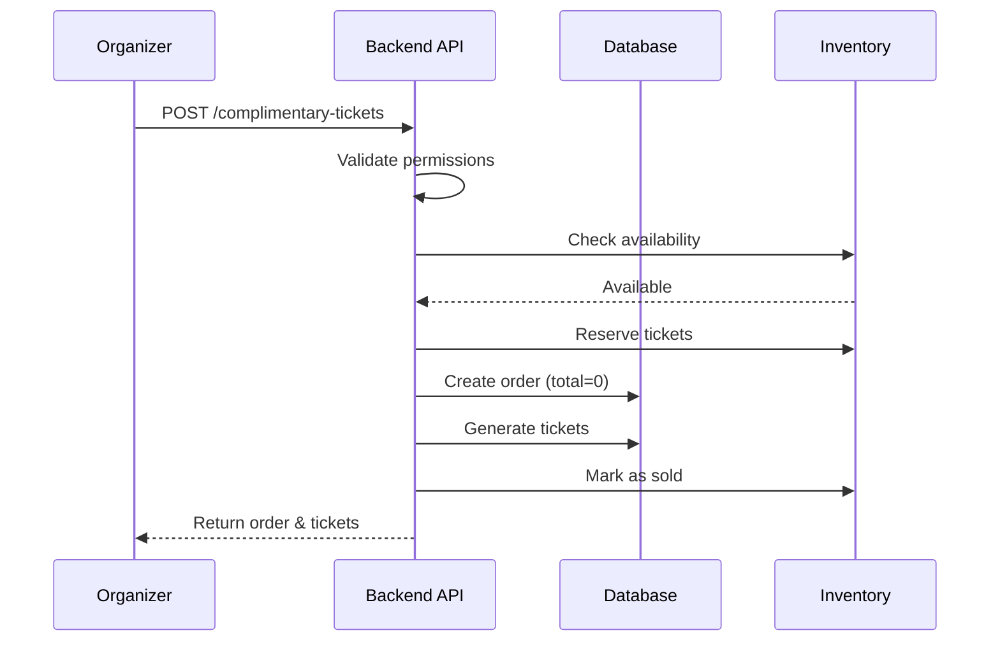
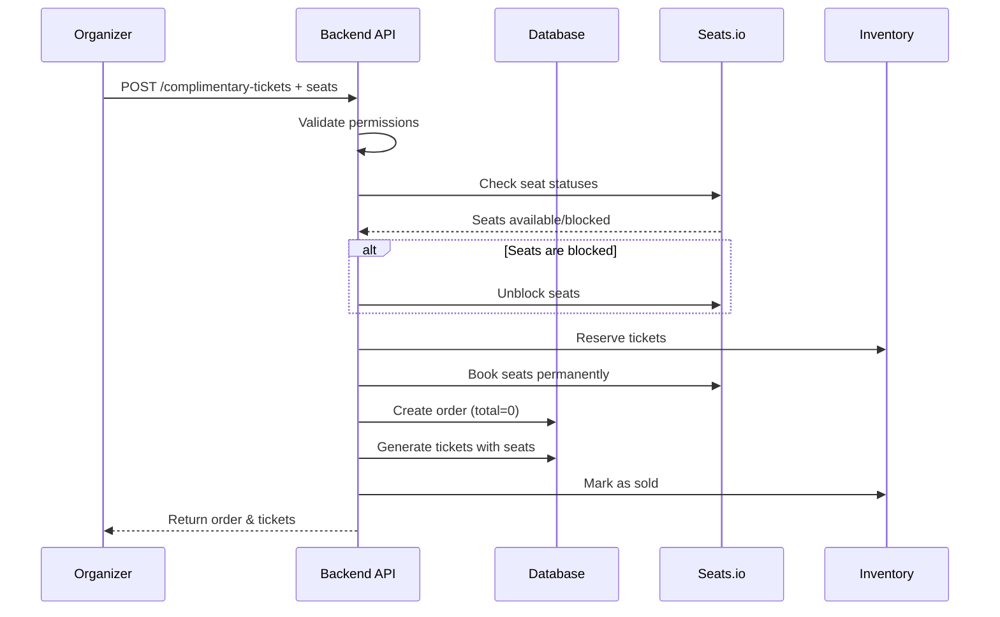

# Complimentary Ticket Issuance API Documentation

> API documentation for issuing complimentary (free) tickets to guests for both general admission and seated events.

---

## Overview

The Complimentary Ticket API allows event organizers and super-admins to issue free tickets without requiring payment. This is useful for:

- **VIP guests** - Complimentary tickets for special guests
- **Sponsors** - Free tickets as part of sponsorship packages
- **Staff/Volunteers** - Tickets for event workers
- **Media/Press** - Press passes for event coverage
- **Promotional purposes** - Giveaways and contests

---

## Base URL

```
https://api.parlomo.co.uk/api
```

## Authentication

All endpoints require Bearer token authentication:

```
Authorization: Bearer {access_token}
```

## Authorization

- **Organizers** can issue complimentary tickets for their own events
- **Super Admins** can issue complimentary tickets for any event

---

## Endpoints Overview

| Method | Endpoint | Description |
|--------|----------|-------------|
| POST | `/ticketing/events/{eventId}/complimentary-tickets` | Issue complimentary tickets |
| GET | `/ticketing/events/{eventId}/complimentary-tickets` | List complimentary tickets for an event |
| GET | `/ticketing/complimentary-tickets/{orderId}` | Get complimentary ticket order details |

---

## 1. Issue Complimentary Tickets

**POST** `/ticketing/events/{eventId}/complimentary-tickets`

Issue free tickets for an event. Supports both general admission and seated events.

### Request Body

```json
{
  "ticket_items": [
    {
      "ticket_type_id": "uuid",
      "quantity": 2
    }
  ],
  "recipient": {
    "name": "John Doe",
    "email": "john@example.com",
    "phone": "+1234567890"
  },
  "selected_seats": ["A-1", "A-2"],
  "reason": "VIP Guest",
  "notes": "Complimentary tickets for sponsor"
}
```

### Parameters

| Field | Type | Required | Description |
|-------|------|----------|-------------|
| `ticket_items` | array | Yes | Array of ticket types and quantities |
| `ticket_items[].ticket_type_id` | UUID | Yes | ID of the ticket type |
| `ticket_items[].quantity` | integer | Yes | Number of tickets (1-50) |
| `recipient` | object | Yes | Recipient information |
| `recipient.name` | string | Yes | Full name of recipient (max 255 chars) |
| `recipient.email` | string | Yes | Email address of recipient |
| `recipient.phone` | string | No | Phone number (max 30 chars) |
| `selected_seats` | array | Conditional | **Required for seated events**. Array of seat labels |
| `selected_seats[]` | string | - | Seat label (e.g., "A-1", "VIP-5") |
| `reason` | string | Yes | Reason for issuing tickets (max 200 chars) |
| `notes` | string | No | Additional notes (max 1000 chars) |

### Important Notes

> [!IMPORTANT]
> **For Seated Events:**
> - `selected_seats` is **required**
> - Number of seats must **exactly match** total ticket quantity
> - Seats can be **available** or **blocked** (blocked seats will be automatically unblocked)
> - Cannot book seats that are already booked by another order

### Success Response (201)

```json
{
  "success": true,
  "message": "2 complimentary ticket(s) issued successfully",
  "data": {
    "order": {
      "id": "550e8400-e29b-41d4-a716-446655440000",
      "order_number": "ORD-2026-000123",
      "status": "paid",
      "total": 0,
      "currency": "GBP",
      "customer_email": "john@example.com",
      "customer_name": "John Doe",
      "is_complimentary": true,
      "reason": "VIP Guest"
    },
    "ticket_count": 2,
    "tickets": [
      {
        "id": "ticket-uuid-1",
        "code": "ABCD-EFGH-IJKL",
        "ticket_type_name": "VIP Ticket",
        "seat_label": "A-1",
        "attendee_name": "John Doe",
        "attendee_email": "john@example.com"
      },
      {
        "id": "ticket-uuid-2",
        "code": "MNOP-QRST-UVWX",
        "ticket_type_name": "VIP Ticket",
        "seat_label": "A-2",
        "attendee_name": "John Doe",
        "attendee_email": "john@example.com"
      }
    ]
  }
}
```

### Error Responses

**Validation Error (422)**
```json
{
  "message": "The given data was invalid.",
  "errors": {
    "ticket_items": ["At least one ticket type must be specified"],
    "selected_seats": ["Number of selected seats must match total quantity (2)"]
  }
}
```

**Unauthorized (403)**
```json
{
  "success": false,
  "message": "You do not have permission to issue complimentary tickets for this event"
}
```

**Insufficient Availability (400)**
```json
{
  "success": false,
  "message": "Not enough tickets available for VIP Ticket"
}
```

**Seats Already Booked (400)**
```json
{
  "success": false,
  "message": "The following seats are already booked: A-1, A-2"
}
```

---

## 2. List Complimentary Tickets

**GET** `/ticketing/events/{eventId}/complimentary-tickets`

Get all complimentary tickets issued for an event.

### Success Response (200)

```json
{
  "success": true,
  "data": [
    {
      "id": "order-uuid-1",
      "order_number": "ORD-2026-000123",
      "customer_name": "John Doe",
      "customer_email": "john@example.com",
      "ticket_count": 2,
      "reason": "VIP Guest",
      "issued_by": "user-uuid",
      "created_at": "2026-01-02T11:00:00Z"
    },
    {
      "id": "order-uuid-2",
      "order_number": "ORD-2026-000124",
      "customer_name": "Jane Smith",
      "customer_email": "jane@example.com",
      "ticket_count": 5,
      "reason": "Media Pass",
      "issued_by": "user-uuid",
      "created_at": "2026-01-02T10:30:00Z"
    }
  ]
}
```

---

## 3. Get Complimentary Ticket Details

**GET** `/ticketing/complimentary-tickets/{orderId}`

Get detailed information about a specific complimentary ticket order.

### Success Response (200)

```json
{
  "success": true,
  "data": {
    "id": "order-uuid",
    "order_number": "ORD-2026-000123",
    "event": {
      "id": "event-uuid",
      "title": "Summer Music Festival 2026"
    },
    "customer_name": "John Doe",
    "customer_email": "john@example.com",
    "customer_phone": "+1234567890",
    "ticket_count": 2,
    "reason": "VIP Guest",
    "notes": "Complimentary tickets for sponsor",
    "issued_by": "user-uuid",
    "issued_by_name": "Admin User",
    "created_at": "2026-01-02T11:00:00Z",
    "tickets": [
      {
        "id": "ticket-uuid-1",
        "code": "ABCD-EFGH-IJKL",
        "ticket_type_name": "VIP Ticket",
        "seat_label": "A-1",
        "seat_display": "Section: VIP, Row: A, Seat: 1",
        "attendee_name": "John Doe",
        "attendee_email": "john@example.com",
        "status": "valid"
      }
    ]
  }
}
```

---

## Flutter Integration

### Service Class

```dart
class ComplimentaryTicketService {
  final Dio _dio;
  final String baseUrl;
  
  ComplimentaryTicketService(this._dio, this.baseUrl);

  /// Issue complimentary tickets
  Future<ComplimentaryTicketResult> issueComplimentaryTickets({
    required String eventId,
    required List<TicketItem> ticketItems,
    required RecipientInfo recipient,
    List<String>? selectedSeats,
    required String reason,
    String? notes,
  }) async {
    final response = await _dio.post(
      '$baseUrl/ticketing/events/$eventId/complimentary-tickets',
      data: {
        'ticket_items': ticketItems.map((item) => {
          'ticket_type_id': item.ticketTypeId,
          'quantity': item.quantity,
        }).toList(),
        'recipient': {
          'name': recipient.name,
          'email': recipient.email,
          if (recipient.phone != null) 'phone': recipient.phone,
        },
        if (selectedSeats != null) 'selected_seats': selectedSeats,
        'reason': reason,
        if (notes != null) 'notes': notes,
      },
    );
    
    if (response.data['success']) {
      return ComplimentaryTicketResult.fromJson(response.data['data']);
    }
    throw Exception(response.data['message']);
  }

  /// Get complimentary tickets for an event
  Future<List<ComplimentaryTicketSummary>> getComplimentaryTickets(
    String eventId,
  ) async {
    final response = await _dio.get(
      '$baseUrl/ticketing/events/$eventId/complimentary-tickets',
    );
    
    if (response.data['success']) {
      return (response.data['data'] as List)
          .map((e) => ComplimentaryTicketSummary.fromJson(e))
          .toList();
    }
    throw Exception(response.data['message']);
  }

  /// Get complimentary ticket order details
  Future<ComplimentaryTicketOrder> getComplimentaryTicketDetails(
    String orderId,
  ) async {
    final response = await _dio.get(
      '$baseUrl/ticketing/complimentary-tickets/$orderId',
    );
    
    if (response.data['success']) {
      return ComplimentaryTicketOrder.fromJson(response.data['data']);
    }
    throw Exception(response.data['message']);
  }
}
```

### Models

```dart
class TicketItem {
  final String ticketTypeId;
  final int quantity;

  TicketItem({
    required this.ticketTypeId,
    required this.quantity,
  });
}

class RecipientInfo {
  final String name;
  final String email;
  final String? phone;

  RecipientInfo({
    required this.name,
    required this.email,
    this.phone,
  });
}

class ComplimentaryTicketResult {
  final OrderInfo order;
  final int ticketCount;
  final List<TicketInfo> tickets;

  ComplimentaryTicketResult({
    required this.order,
    required this.ticketCount,
    required this.tickets,
  });

  factory ComplimentaryTicketResult.fromJson(Map<String, dynamic> json) {
    return ComplimentaryTicketResult(
      order: OrderInfo.fromJson(json['order']),
      ticketCount: json['ticket_count'],
      tickets: (json['tickets'] as List)
          .map((e) => TicketInfo.fromJson(e))
          .toList(),
    );
  }
}

class OrderInfo {
  final String id;
  final String orderNumber;
  final String status;
  final int total;
  final String currency;
  final String customerEmail;
  final String customerName;
  final bool isComplimentary;
  final String reason;

  OrderInfo({
    required this.id,
    required this.orderNumber,
    required this.status,
    required this.total,
    required this.currency,
    required this.customerEmail,
    required this.customerName,
    required this.isComplimentary,
    required this.reason,
  });

  factory OrderInfo.fromJson(Map<String, dynamic> json) {
    return OrderInfo(
      id: json['id'],
      orderNumber: json['order_number'],
      status: json['status'],
      total: json['total'],
      currency: json['currency'],
      customerEmail: json['customer_email'],
      customerName: json['customer_name'],
      isComplimentary: json['is_complimentary'],
      reason: json['reason'],
    );
  }
}

class TicketInfo {
  final String id;
  final String code;
  final String? ticketTypeName;
  final String? seatLabel;
  final String attendeeName;
  final String attendeeEmail;

  TicketInfo({
    required this.id,
    required this.code,
    this.ticketTypeName,
    this.seatLabel,
    required this.attendeeName,
    required this.attendeeEmail,
  });

  factory TicketInfo.fromJson(Map<String, dynamic> json) {
    return TicketInfo(
      id: json['id'],
      code: json['code'],
      ticketTypeName: json['ticket_type_name'],
      seatLabel: json['seat_label'],
      attendeeName: json['attendee_name'],
      attendeeEmail: json['attendee_email'],
    );
  }
}
```

---

## Usage Examples

### Example 1: Issue Complimentary Tickets for General Admission

```dart
// Issue 5 complimentary tickets for a general admission event
final result = await complimentaryTicketService.issueComplimentaryTickets(
  eventId: eventId,
  ticketItems: [
    TicketItem(ticketTypeId: generalAdmissionTypeId, quantity: 5),
  ],
  recipient: RecipientInfo(
    name: 'Jane Smith',
    email: 'jane@example.com',
    phone: '+1234567890',
  ),
  reason: 'Media Pass',
  notes: 'Press credentials for event coverage',
);

print('Order Number: ${result.order.orderNumber}');
print('Tickets Issued: ${result.ticketCount}');
```

### Example 2: Issue Complimentary Tickets for Seated Event

```dart
// Issue 2 VIP tickets with specific seats
final result = await complimentaryTicketService.issueComplimentaryTickets(
  eventId: eventId,
  ticketItems: [
    TicketItem(ticketTypeId: vipTicketTypeId, quantity: 2),
  ],
  recipient: RecipientInfo(
    name: 'VIP Guest',
    email: 'vip@example.com',
  ),
  selectedSeats: ['VIP-1', 'VIP-2'], // Required for seated events
  reason: 'Sponsor',
  notes: 'Platinum sponsor package',
);

// Seats are now booked in Seats.io
for (var ticket in result.tickets) {
  print('Ticket ${ticket.code} - Seat: ${ticket.seatLabel}');
}
```

### Example 3: List All Complimentary Tickets

```dart
final complimentaryTickets = await complimentaryTicketService
    .getComplimentaryTickets(eventId);

for (var ticket in complimentaryTickets) {
  print('${ticket.orderNumber} - ${ticket.customerName} - ${ticket.reason}');
}
```

---

## Workflow Diagrams

### General Admission Flow



### Seated Event Flow



---

## Important Notes

1. **No Payment Required**: Complimentary tickets have `total = 0` and `status = 'paid'`

2. **Inventory Management**: Complimentary tickets count against ticket inventory just like paid tickets

3. **Blocked Seats**: If you select blocked seats, they will be **automatically unblocked** and booked

4. **Already Booked Seats**: Cannot issue complimentary tickets for seats that are already booked by another order

5. **Audit Trail**: All complimentary tickets track:
   - Who issued them (`issued_by`)
   - Why they were issued (`reason`)
   - When they were issued (`created_at`)

6. **Ticket Validity**: Complimentary tickets work exactly like paid tickets for:
   - QR code scanning
   - Check-in at events
   - Transfers (if allowed)

---

## Error Handling

Always handle these common errors in your UI:

```dart
try {
  final result = await complimentaryTicketService.issueComplimentaryTickets(...);
  // Success
} on DioException catch (e) {
  if (e.response?.statusCode == 403) {
    // Show: "You don't have permission to issue complimentary tickets"
  } else if (e.response?.statusCode == 400) {
    final message = e.response?.data['message'];
    if (message.contains('already booked')) {
      // Show: "Selected seats are already booked. Please choose different seats."
    } else if (message.contains('Not enough tickets')) {
      // Show: "Not enough tickets available"
    }
  } else if (e.response?.statusCode == 422) {
    // Show validation errors
    final errors = e.response?.data['errors'];
  }
}
```

---

## Testing

Use these test scenarios:

1. **General Admission**: Issue 2 complimentary tickets
2. **Seated Event**: Issue 3 tickets with seat selection
3. **Blocked Seats**: Issue tickets for blocked seats (verify auto-unblock)
4. **Validation**: Try mismatched seat count (should fail)
5. **Already Booked**: Try booking already-booked seats (should fail)
6. **Unauthorized**: Try as non-organizer (should fail)
